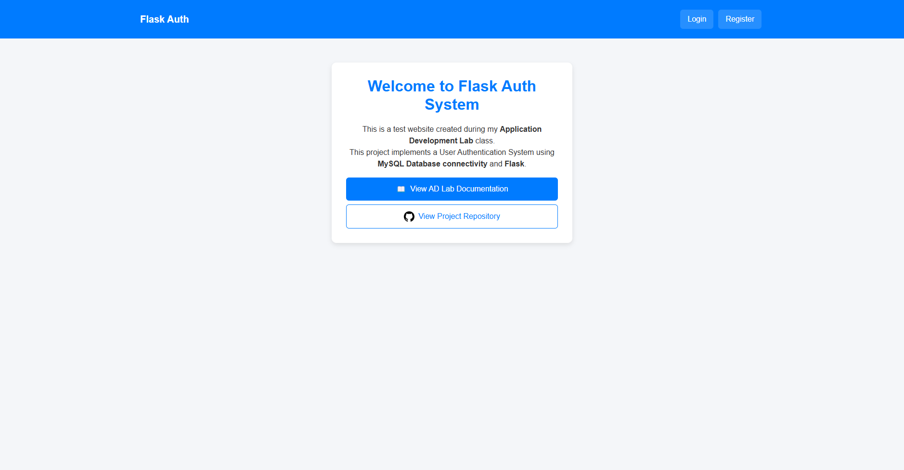

# Flask Auth using MySQL Database

<p align="center"><strong>This project implements a User Authentication System using MySQL Database connectivity and Flask.</strong></p>

---

## 🚀 Features

- 🌐 Scrape websites, YouTube transcripts, or perform keyword searches.
- 🤖 Uses **Gemini Flash 2.0** API for intelligent text processing.
- 🔎 DuckDuckGo-powered web search for relevant content.
- 🖥️ **Flask** backend with a **Next.js** frontend.
- 🎨 Styled using **Tailwind CSS**.

---

## 🖼️ Preview


---

## 📜 License  

Flask Auth is open-source and released under the **MIT License**.  
See the [LICENSE](./LICENSE) file for more details.

---

## 🛠️ Get Started

### 1️⃣ Clone the Repository
```sh
git clone "https://github.com/QwertyFusion/Database-Management-Using-Flask"
cd Database-Management-Using-Flask
```

### 2️⃣ Backend Setup (Flask)

#### Create and Activate Virtual Environment (venv)
```sh
python -m venv venv  # Create virtual environment
source venv/bin/activate  # MacOS/Linux
venv\Scripts\activate  # Windows
```

#### Install Dependencies
```sh
pip install -r requirements.txt
```

### 3️⃣ Database Setup (MySQL and MySQL Workbench)

#### Install MySQL Server and MySQL Workbench from official websites


### 4️⃣ Environment Variables

#### Create `.env` similar to `.env.example` for Flask Backend connectivity with your MySQL Database server:
```env
SECRET_KEY=mysecretkey # Keep this same, no need to change or delete
MYSQL_HOST=YOUR_MYSQL_SERVER_HOST
MYSQL_USER=root
MYSQL_PASSWORD=YOUR_MYSQL_SERVER_PASSWORD
MYSQL_DB=user_management # Your Database name
```

### 5️⃣ Run the Project

#### Start the Flask Backend
```sh
python app.py  # Ensure the virtual environment is activated
```

Now, open your browser and go to **http://127.0.0.1:5000** to start using Flask Auth! 🚀

---

## 🛠 Tools Used  

<ol>
  <li>Visual Studio Code</li>
  <li>Next.js</li>
  <li>TypeScript</li>
  <li>Tailwind CSS</li>
  <li>Flask</li>
  <li>BeautifulSoup (Web Scraping)</li>
  <li>DuckDuckGo Search API</li>
  <li>YouTube Transcript API</li>
  <li>Gemini API (AI Processing)</li>
  <li>Git & GitHub (Version Control)</li>
</ol>

---

## 🔗 Link to Tools  

<p align="left">
<a href="https://code.visualstudio.com" target="_blank" rel="noreferrer">
  
</a>&emsp;
<a href="https://nextjs.org/" target="_blank" rel="noreferrer">
  
</a>&emsp;
<a href="https://www.typescriptlang.org/" target="_blank" rel="noreferrer">
  
</a>&emsp;
<a href="https://tailwindcss.com/" target="_blank" rel="noreferrer">
  
</a>&emsp;
<a href="https://flask.palletsprojects.com/" target="_blank" rel="noreferrer">
  
</a>&emsp;
<a href="https://www.crummy.com/software/BeautifulSoup/" target="_blank" rel="noreferrer">
  
</a>&emsp;
<a href="https://duckduckgo.com/" target="_blank" rel="noreferrer">
  
</a>&emsp;
<a href="https://developers.google.com/youtube/v3/docs/captions" target="_blank" rel="noreferrer">
  
</a>&emsp;
<a href="https://ai.google.dev/" target="_blank" rel="noreferrer">
  
</a>&emsp;
<a href="https://git-scm.com/" target="_blank" rel="noreferrer">
  
</a>&emsp;
<a href="https://github.com/" target="_blank" rel="noreferrer">
  
</a>
</p>

---

## 👨‍💻 Developer  

<ul>
  <li><a href="https://github.com/QwertyFusion">[@QwertyFusion]</a></li>
</ul>
